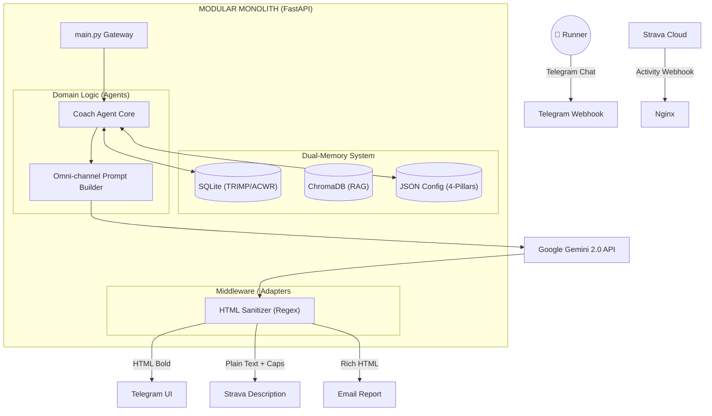

# 🏃‍♂️ Personal AI OS
### Autonomous Agentic System v2.9.0 (The Omni-channel Coach)

*A proactive, context-aware AI Agent operating on a lightweight Home Lab (Lenovo T440), evolving from a reactive chatbot to a fully autonomous orchestrator with Omni-channel output capabilities.*

---

## 📖 1. Project Introduction

[cite_start]**Personal AI OS** is a specialized, multi-tenant capable AI Agent system[cite: 23]. [cite_start]Currently incarnated as **Coach Dyno**, its primary mission is to autonomously guide the user towards a specific running goal (e.g., Sub 1:45 Half Marathon)[cite: 23].

**The Agentic Core (v2.9.0 Update):**
Unlike traditional chatbots that rely on "prompt stuffing", this system is built on a **4-Pillar Modular Prompt Architecture**:
1. [cite_start]**Perception:** Real-time ingestion of Strava webhooks, Telegram chats, and Cron-based temporal awareness[cite: 24].
2. [cite_start]**Memory (Dual-System):** Combining structured sports science data (SQLite) with semantic long-term memory (ChromaDB RAG)[cite: 25].
3. [cite_start]**Reasoning (Decoupled Logic):** Utilizing the 4-Pillar Prompt system (Task, Analysis Requirements, Report Structure, Format Rules) to separate Domain Logic from Presentation[cite: 101, 103, 105, 107].
4. **Action (Omni-channel Adapter):** The Agent thinks once but outputs dynamically across platforms: HTML for Telegram, Plain-text/Emoji for Strava, and Rich-HTML for Email, guarded by a Regex Middleware Sanitizer.

---

## 🏗️ 2. System Architecture

[cite_start]The system utilizes a decoupled Modular Monolith infrastructure[cite: 29].

# 🗺️ THE MASTER ROADMAP: PERSONAL AI OS (COACH DYNO)

## 🟢 PHẦN 1: KỶ NGUYÊN NỀN TẢNG & NHẬN THỨC (v1.0 - v2.5)

*Trạng thái: Đã hoàn thành (Completed)*
*Mục tiêu: Xây dựng bộ khung kỹ thuật, kết nối API và tạo ra một Chatbot hiểu dữ liệu thể thao.*

* **Phase 1: The Sensing Foundation (Giác quan)**
* Tích hợp Webhook Strava (Auto-Harvest với 5s Downsampling).
* Tích hợp Telegram Bot API (Nhận lệnh và gửi tin nhắn).

* **Phase 2: The Dual-Memory (Trí nhớ kép)**
* Xây dựng cơ sở dữ liệu có cấu trúc (SQLite) lưu trữ Kế hoạch và Mục tiêu tuần.
* Tích hợp ChromaDB làm nền tảng RAG sơ khởi.

* **Phase 3: The Tool-Using Expert (Biết dùng công cụ)**
* Kích hoạt Automatic Function Calling (AFC) của Gemini.
* AI bắt đầu biết gọi các hàm như `update_todays_plan` và `set_actual_weekly_target`.

## 🔵 PHẦN 2: KỶ NGUYÊN ĐA KÊNH & TỰ TRỊ CƠ BẢN (v2.6 - v2.9.0)

*Trạng thái: HIỆN TẠI (Current Baseline)*
*Mục tiêu: Đưa AI từ thế "Thụ động chờ lệnh" sang "Chủ động kiểm soát", xuất bản nội dung đa nền tảng.*

* **Phase 4: Proactive Autonomy & Omni-channel**
* **Luồng Tự trị (Proactive):** Cronjob Standup buổi sáng, tự động tính toán ACWR, TRIMP bảo vệ sinh lý VĐV.
* **Kiến trúc Prompt:** Áp dụng mô hình **4 Trụ cột** (Task, Analysis, Structure, Format), cấu hình động qua Admin Dashboard.
* **Middleware:** Xây dựng Regex Sanitizer chống lỗi Markdown crash Telegram.
* **SSOT (Nguồn sự thật duy nhất):** Ép AI ưu tiên đọc Database thay vì chat history, giải quyết triệt để lỗi Hallucination (Ảo giác).

---

## *(Vạch xuất phát cho chặng đường mới)*

## 🚀 PHẦN 3: KỶ NGUYÊN ĐẠI DIỆN TỰ TRỊ BẬC CAO (v3.0 - v3.x)

*Trạng thái: Đang triển khai (In Progress)*
*Mục tiêu: Trang bị tư duy Tự phản tỉnh (Self-Reflection), nền tảng Khoa học thể thao tự trị, và năng lực nhận thức môi trường.*

* **Phase 5: The Resilient Thinker (Tư duy Bền bỉ - Đã hoàn thành v3.0)**
  * **Task 5.1 - ReAct Error Handling:** [DONE] Nâng cấp Agent với cơ chế Exponential Backoff tự xử lý lỗi 429/503 từ Google API.
  * **Task 5.2 - Demarcation Line Refactor:** [DONE] Áp dụng chuẩn quốc tế Zone 1 (100% English Source/DB) và Zone 2/3 (Vietnamese Logic/UI).
  * **Task 5.3 - Weekly Self-Reflection:** [DONE] Cronjob tối Chủ Nhật tự động review giáo án tuần cũ và chốt Target Volume cho tuần mới.

* **Phase 6: The Autonomous Sports Scientist (Chuyên gia Thể thao - Dự kiến v3.1)**
  * **Task 6.1 - Local Data Lake:** Lưu trữ Raw Data Streams (Time-series) từ Strava dưới dạng JSON local, giảm tải DB và bảo vệ Quota LLM.
  * **Task 6.2 - Pure Python Engine:** Tự xây dựng module phân tích cơ sinh học (Aerobic Decoupling, Time in Zones) bằng Python thuần (No Pandas) để thay thế việc ép LLM tính toán.
  * **Task 6.3 - Post-Run Weather Perception:** Bóc tách `average_temp` từ thiết bị Garmin/Coros trên Strava để AI nhận diện tác động của Cardiac Drift khi chạy dưới trời nóng.
  * **Task 6.4 - Proactive RAG:** Hệ thống tự động truy xuất tiền sử chấn thương từ ChromaDB nhúng thẳng vào Prompt trước khi Standup sáng.

* **Phase 7: The Omniscient Coach (Coach Toàn năng - Dự kiến v3.2)**
  * **Task 7.1 - Environment Perception (Standup & Race Day):** * [DONE] Tích hợp thời tiết hiện tại vào Morning Briefing.
    * [TODO] Gọi Forecast API 5 ngày vào Tuần Taper để lên chiến thuật Race Day (Nước/Muối/Pace) dựa trên nhiệt độ giải chạy.
  * **Task 7.2 - Event-Driven Autonomy:** Lắng nghe tín hiệu HRV/Resting HR trực tiếp từ Garmin/Apple Health giữa đêm để tự động điều chỉnh bài tập sáng sớm.