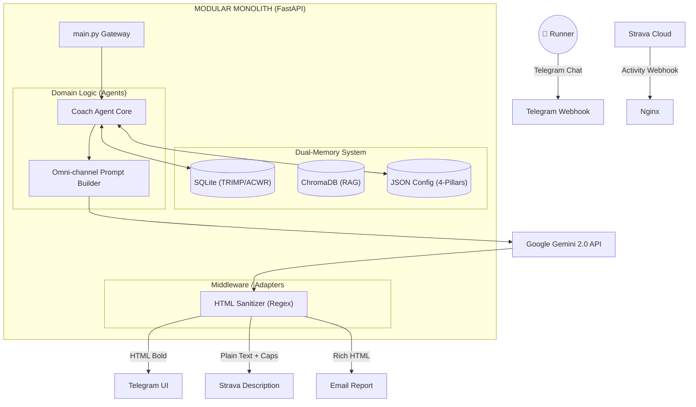

# 🏃‍♂️ Personal AI OS
### Autonomous Agentic System v2.9.0 (The Omni-channel Coach)

*A proactive, context-aware AI Agent operating on a lightweight Home Lab (Lenovo T440), evolving from a reactive chatbot to a fully autonomous orchestrator with Omni-channel output capabilities.*

---

## 📖 1. Project Introduction

[cite_start]**Personal AI OS** is a specialized, multi-tenant capable AI Agent system[cite: 23]. [cite_start]Currently incarnated as **Coach Dyno**, its primary mission is to autonomously guide the user towards a specific running goal (e.g., Sub 1:45 Half Marathon)[cite: 23].

**The Agentic Core (v2.9.0 Update):**
Unlike traditional chatbots that rely on "prompt stuffing", this system is built on a **4-Pillar Modular Prompt Architecture**:
1. [cite_start]**Perception:** Real-time ingestion of Strava webhooks, Telegram chats, and Cron-based temporal awareness[cite: 24].
2. [cite_start]**Memory (Dual-System):** Combining structured sports science data (SQLite) with semantic long-term memory (ChromaDB RAG)[cite: 25].
3. [cite_start]**Reasoning (Decoupled Logic):** Utilizing the 4-Pillar Prompt system (Task, Analysis Requirements, Report Structure, Format Rules) to separate Domain Logic from Presentation[cite: 101, 103, 105, 107].
4. **Action (Omni-channel Adapter):** The Agent thinks once but outputs dynamically across platforms: HTML for Telegram, Plain-text/Emoji for Strava, and Rich-HTML for Email, guarded by a Regex Middleware Sanitizer.

---

## 🏗️ 2. System Architecture

[cite_start]The system utilizes a decoupled Modular Monolith infrastructure[cite: 29].

---

## 🗺️ 3. The Agentic Evolution Roadmap

### ✅ Phase 1 & 2: The Sensing Foundation (Completed)

* Hybrid Strava Sync (Webhooks + Auto-Harvest with 5s Downsampling).

* Dual-Memory architecture (SQLite + ChromaDB RAG).

### ✅ Phase 3: The Tool-Using Expert (Completed)

* 
**Automatic Function Calling (AFC):** Dynamic tool usage (`update_todays_plan`, `set_actual_weekly_target`, etc.).

* Data Integrity & Sync Fixes: UPSERT logic and Strava Activity Deletion hooks.

### ✅ Phase 4: Proactive Autonomy & Omni-channel (Completed)

* **Proactive Interventions:** Background workers monitor ACWR. The Agent autonomously initiates Standups and adjusts plans.

* **4-Pillar Prompt Architecture:** Separation of Concerns (SoC) between Analysis Logic and Display Formatting.
* **Middleware Sanitization:** Defending against LLM Markdown Hallucinations to prevent API crashes.
* **Single Source of Truth:** Enforcing DB targets over past chat histories to prevent AI memory conflicts.

### 🔮 Phase 5: The Multi-Agent Ecosystem (Late 2026)

* **Self-Reflection Loop:** A weekly chron-job where the Agent evaluates its past advice.

* **Supervisor Orchestrator:** Convert `main.py` into a Router Agent.

* **Finance Agent:** Add personal budget tracking and gear depreciation.