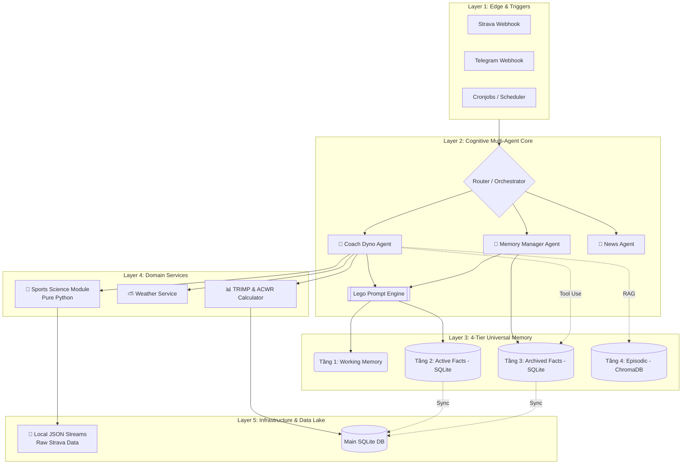

# 🏛️ Hệ điều hành Trí tuệ Nhân tạo Cá nhân (Personal AI OS Architecture)

**Phiên bản:** v4.0 (Draft) | **Trạng thái:** Đang nâng cấp (Phase 6 & 8)
**Định hướng:** Event-Driven (Hướng sự kiện) & Multi-Agent Modular (Đa tác tử Mô-đun hóa).

## 1. Biểu đồ Kiến trúc Tổng thể (The System Graph)



## 2. Phân tích 5 Phân lớp (The 5 Layers Breakdown)

Kiến trúc tuân thủ triết lý **Separation of Concerns (Phân tách Trách nhiệm)** và quy tắc **Zone 1 (Logic) / Zone 3 (UI)**:

### 🌐 Layer 1: Edge & Triggers (Kích hoạt)

* **Nhiệm vụ:** Nhận tín hiệu từ thế giới thực. Không chứa logic suy luận (Zero Cognitive Logic).
* **Thành phần:** Webhook Strava (khi chạy xong), Webhook Telegram (khi người dùng chat), và Đồng hồ báo thức ngầm (Scheduler/Cronjobs).

### 🧠 Layer 2: Cognitive Multi-Agent Core (Lõi Nhận thức)

* **Nhiệm vụ:** Bộ não trung tâm. Xử lý ngôn ngữ tự nhiên (LLM), đưa ra quyết định.
* **Thành phần:** - **Orchestrator:** Phân luồng tín hiệu đến đúng Agent.
* **Coach Agent:** Chuyên trách thể thao, giáo án.
* **Memory Agent (Background):** Chạy ngầm để trích xuất ký ức.
* **Prompt Engine:** Xây dựng bối cảnh linh hoạt theo "Kiến trúc Lego".


### 🗄️ Layer 3: 4-Tier Universal Memory (Bộ nhớ 4 Tầng)

* **Nhiệm vụ:** Giải quyết bài toán Token Limits và LLM Hallucination.
* **Tầng 1 (Working):** Cửa sổ chat hiện tại (Gemini Context).
* **Tầng 2 (Active Facts):** Những trạng thái hiện tại (Đau gối, Đang Taper) tiêm trực tiếp vào mọi Prompt.
* **Tầng 3 (Archived Facts):** Ký ức quá khứ (Năm 2024), bị chặn khỏi Prompt, chỉ gọi ra bằng Tool/Function.
* **Tầng 4 (Episodic):** CSDL Vector RAG (ChromaDB) lưu văn bản thô, cảm xúc.

### 🔬 Layer 4: Domain Services (Dịch vụ Nghiệp vụ)

* **Nhiệm vụ:** Nơi Python làm Toán thay AI. 100% tiếng Anh (Zone 1).
* **Thành phần:** Phân tích độ trượt tim mạch (Decoupling) bằng Python thuần, Fetch API Thời tiết (OpenWeather), tính toán ACWR.

### 📁 Layer 5: Infrastructure & Data Lake (Hạ tầng)

* **Nhiệm vụ:** Lưu trữ cứng.
* **Thành phần:** SQLite cho cấu trúc/quan hệ, JSON File System cho dữ liệu chuỗi thời gian (Time-series) siêu nặng, Nginx SSL.

## 3. Nguyên tắc Kiến trúc cốt lõi (Core Principles)

1. **Python làm Toán, AI làm Thơ (Compute vs. Reason):** AI không bao giờ tính toán mảng dữ liệu lớn. Python xử lý xong gửi Insights cho AI "dịch" ra lời khuyên.
2. **KISS & YAGNI:** Không dùng các thư viện nặng như Pandas hay framework quản lý bộ nhớ cồng kềnh (Mem0). Tự build bằng Pure Python.
3. **Event-Driven Resilience:** Các tiến trình giao tiếp bất đồng bộ, sử dụng Exponential Backoff để chống sập khi Google API Rate Limit.

```