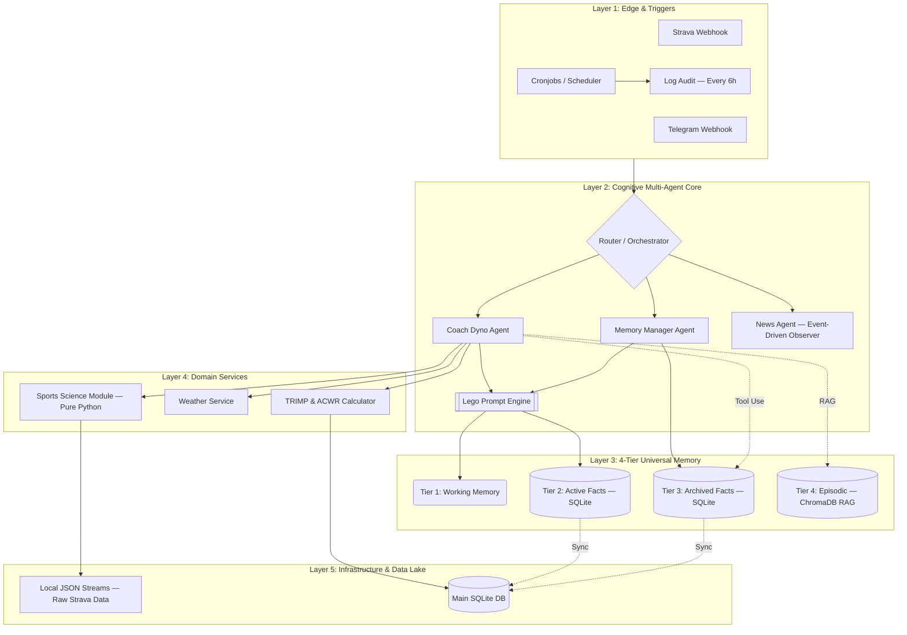

# System Architecture — Personal AI OS

**Version:** v5.4 | **Status:** Production (1010+ tests, 0 failures)
**Pattern:** Event-Driven, Multi-Agent Modular

---

## System graph

---

## Layer breakdown

### Layer 1: Edge & Triggers

Receives signals from the real world. Contains zero cognitive logic.

| Component | Role |
|-----------|------|
| Strava Webhook | Fires when athlete completes a run |
| Telegram Webhook | User-facing chat interface |
| Scheduler (APScheduler) | Time-based crons: morning briefing, harvest, weekly reflection, news |
| Log Audit (6h interval) | Scans `app.log*`, persists findings to `audit_entries` table |

### Layer 2: Cognitive Multi-Agent Core

All LLM reasoning happens here. Respects Zone 3 (logic=English, user-facing strings=Vietnamese).

| Component | Role |
|-----------|------|
| Router/Orchestrator | Routes Telegram commands and Strava events to correct agent |
| Coach Agent (Dyno) | Training plans, run analysis, morning briefing, weekly reflection |
| Memory Manager Agent | Background extraction and decay of `core_memory` facts |
| News Agent | Event-driven RSS observer, grounded Gemini search, breaking alerts |
| Prompt Engine | Lego-style context assembler — injects memory, metrics, phase, weather |

### Layer 3: 4-Tier Universal Memory

Solves token limits and hallucination without external memory services.

| Tier | Storage | Behavior |
|------|---------|----------|
| 1 — Working | Gemini context window | Last 30 messages; auto-evicts |
| 2 — Active Facts | `core_memory` table (SQLite) | `status=active` rows injected into every prompt |
| 3 — Archived Facts | `core_memory` table (SQLite) | `status=inactive`; retrieved only via Tool Use |
| 4 — Episodic | ChromaDB (RAG) | Vector embeddings of run analyses and reflections |

### Layer 4: Domain Services

**"Python does math, AI does prose."** 100% Zone 1 (English code).

| Service | Responsibility |
|---------|---------------|
| Sports Science Module | HR zones, TRIMP, ACWR, aerobic decoupling, GCS |
| Weather Service | OpenWeather forecast, heat index context |
| Plan & Load Calculator | Target volume, taper schedule, 15% ramp rule |

### Layer 5: Infrastructure & Data Lake

| Component | Details |
|-----------|---------|
| SQLite (WAL mode) | Relational data: runs, plans, memory, news, audit |
| Local JSON streams (`data/streams/`) | Raw Strava time-series per activity; never stored in DB |
| Nginx + DuckDNS | SSL/TLS termination, reverse proxy |

---

## Core architectural principles

1. **Python does math, AI does prose** — AI never computes arrays. Python derives ACWR, decoupling, zones; passes insights to Gemini.
2. **KISS & YAGNI** — No Pandas, no Mem0, no message queues. Pure Python + SQLite covers current scale.
3. **Event-Driven Resilience** — Exponential backoff (5s/10s/20s, cap 60s) on all Gemini and Telegram calls. 504/503/429 covered.
4. **Explicit dependencies** — All services injected; no hidden `os.getenv` inside business logic.
5. **Multi-tenant by default** — Every DB table has `user_id`; every query includes `WHERE user_id = ?`.

---

## Key file map

| Concern | Files |
|---------|-------|
| Webhook ingestion | `app/routers/webhooks.py` |
| Coach agent orchestrator | `app/agents/coach/agent.py` |
| Coach flows | `app/agents/coach/flows/` |
| Prompt builder | `app/agents/coach/prompts.py` |
| News agent | `app/agents/news/agent.py`, `prompts.py`, `telegram_handler.py` |
| Scheduler | `app/services/scheduler.py` |
| Database layer | `app/core/database.py` |
| Config | `app/core/config.py` + `config.example.json` |
| Memory (RAG) | `app/services/rag_memory.py` |

See [database.md](database.md) for full schema, [memory.md](memory.md) for the 4-tier memory design.
